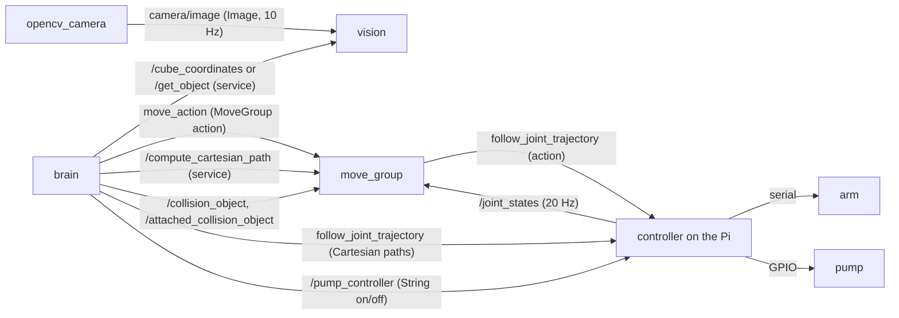
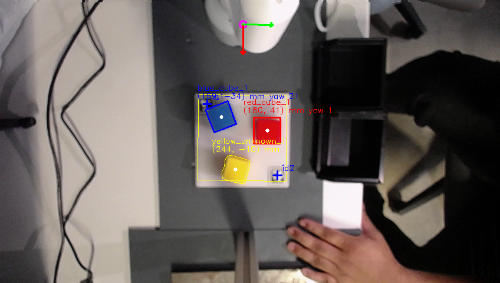
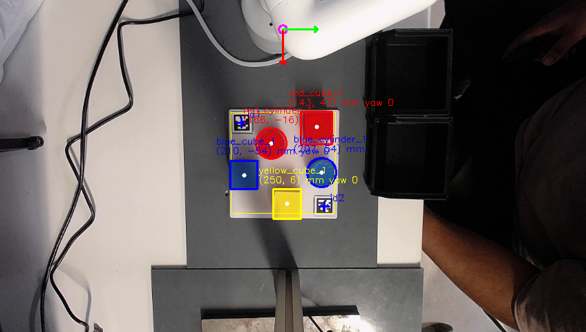

# Lab 9 – Pick and Place with MoveIt: report

Group: TODO · Date of the lab sessions: 2026-10-05, TODO · PDF: *Pick and Place* (Sep 23, 2026)

**Scope (PDF p. 2):** Part 0 (required) and two of the five tasks: **Detecting Object Color and Shape** (pp. 22–25) and
**Structure of brain.py and Extension of the Object Interface** (pp. 20–22). Both tasks extend the same query
(colour + shape → object), so they are evaluated together on the same scenes.

> How to fill this draft: every `TODO` needs a number, an image or a sentence from the lab. Tables marked
> *(logger)* are printed by `python3 solutions/lab9_real_hardware/lab9_eval_logger.py summary` (run from the repo root).
> Delete this box before handing in.

---

## 1. Setup and system

| Item | Value |
|---|---|
| Robot | myCobot 280 Pi, vacuum pump at the flange (pump GPIO 20, release valve GPIO 21) |
| Computers | Lab PC (camera, vision, MoveIt, brain) and the robot's Raspberry Pi (controller), ROS 2 Jazzy, `ROS_DOMAIN_ID` 47 |
| Camera | USB camera (Logitech C930e) above the plate, looking down, 848×480 (the course `opencv_camera` sets no resolution; this is what it published on 2026-10-05) |
| Objects | cubes 35 mm (measured; the course code assumed 40 mm); cylinders Ø 35 mm, height TODO mm; colours: TODO |
| Calibration used | 2 ArUco markers (DICT_6X6_50, ids 1 and 2) at measured robot coordinates TODO / TODO mm → planar pixel → robot map with a height correction (camera looks straight down). This is a working calibration, **not** the calibration task (not chosen); see §6 |
| Frames and units | robot base frame `g_base`: x forward, y left, z up; positions in m (tables in mm), angles in rad (tables in °) |

### 1.1 Data flow (PDF Part 0 item 4; competence p. 25)



The same as an ordered list, for one pick-and-place:
1. The camera node publishes the image on `camera/image`.
2. Vision segments each colour in HSV, finds the objects and converts their image centre to `g_base` coordinates.
3. Brain asks vision for an object (course: `/cube_coordinates` with a colour; our version: `/get_object` with colour + shape).
4. Brain adds the objects to MoveIt's planning scene (`/collision_object`) and sends the hover pose to `move_action`; MoveIt
   plans and has the trajectory executed by the controller through `follow_joint_trajectory`.
5. Brain gets a straight-line descent from `/compute_cartesian_path` and sends it to the controller itself.
6. Brain switches the pump on (`/pump_controller`), attaches the object to `pump_head` (`/attached_collision_object`), retracts.
7. Brain moves above the destination, switches the pump off, detaches the object, moves home.
8. Throughout, the controller publishes `/joint_states`; MoveIt plans from it.

### 1.2 Programs and execution order

All files are in this package (`pp_moveit_ws/src/lab9_pick_place/`) unless a path says otherwise. The course packages are
used unchanged (MoveIt config `mycobot_280_moveit2`, camera `mycobot_280pi opencv_camera`, `mycobot_description`).

| Order | Program | Runs on | Started with | Role |
|---|---|---|---|---|
| 0 | `../lab9_interfaces/srv/GetObject.srv`, `setup.py` | Lab PC (build) | `colcon build --symlink-install --packages-select lab9_interfaces lab9_pick_place` | generates the `GetObject` Python class; installs `vision_lab9` and `brain_lab9` as `ros2 run` programs, the launch files and `config/lab9.yaml` |
| 1 | `lab9_pick_place/controller_lab9.py` | Pi | `python3 …/controller_lab9.py` (first) | robot driver: `/joint_states` at 20 Hz, `follow_joint_trajectory` action server, pump and valve |
| 2 | `launch/lab9_real.launch.py` → `launch/lab9_moveit.launch.py`, `opencv_camera`, `lab9_pick_place/vision_lab9.py` | Lab PC | `ros2 launch lab9_pick_place lab9_real.launch.py` | `move_group` with longer execution limits; camera image; vision: calibration, detection, `/get_object` |
| 3 | `lab9_pick_place/brain_lab9.py` | Lab PC | `ros2 run lab9_pick_place brain_lab9` (last: it moves the arm home at start) | menu, planning scene, MoveIt goals, pick / drop / stack |
| – | `config/lab9.yaml` | Lab PC | read once when a node starts | every number: markers, HSV, shape thresholds, heights, bins, home |
| eval | `solutions/lab9_real_hardware/lab9_eval_logger.py` (repo root) | Lab PC / any | `python3 … query / features / summary` | report tables; never moves the robot |

Appendix C walks through these programs block by block, in the order they execute.

### 1.3 Course (demo) packages vs. final implementation

The course packages (`pp_moveit_ws/src/mycobot_*`) are **unchanged**: `git diff 04c715b -- pp_moveit_ws/src/mycobot_*`
is empty, where `04c715b` is the state as delivered. Part 0 therefore runs the original system.

Everything new is in two own packages:
- `lab9_interfaces`: the service.
- `lab9_pick_place`: the nodes, launch files and configuration.

The course packages are used by name, but none of their files are edited.

| Course package / file (as delivered) | Final implementation | Kind of change | Why (PDF item or lab finding) |
|---|---|---|---|
| `mycobot_interfaces/srv/GetCubeCoords.srv`: `color` → `coords` | `lab9_interfaces/srv/GetObject.srv`: `color`, `shape`, `id` → `found`, `id`, `shape`, `coords`, `height`, `matches` | new package; the course service is still served | object interface item 1 |
| `mycobot_vision/vision.py` | `vision_lab9.py` | new node, not a copy | shape task items 1–5. The course node had a fixed pixel map for another camera pose, one cube per colour, and detections that never expire |
| `mycobot_brain/brain.py` | `brain_lab9.py` | edited copy | object interface items 2–6; real-robot fixes (heights, retries, error handling, home posture) |
| `mycobot_controller/controller.py` | `controller_lab9.py` | copy + 2 fixes | not a PDF item, but needed on the real robot: release valve, stop-and-go execution |
| `mycobot_280_moveit2/launch/move_group.launch.py` | `launch/lab9_moveit.launch.py` | copy + 2 parameters | every move ended `TIMED_OUT` (−6) while the arm kept moving |
| `mycobot_brain/launch/brain.launch.py` | `launch/lab9_real.launch.py` | new, same tab pattern | the brain is no longer started automatically, because it moves the arm |
| numbers hard-coded in `vision.py` and `brain.py` | `config/lab9.yaml` | new | all measured values in one place; edit and restart, no rebuild |
| – | `solutions/lab9_real_hardware/lab9_eval_logger.py` | new | evaluation tables (Appendix B) |

Used unchanged:
- MoveIt configuration and URDF scene (`mycobot_280_moveit2`, `mycobot_description`).
- Camera node (`mycobot_280pi opencv_camera`).
- `GetCubeCoords` (`mycobot_interfaces`).
- The brain's planning methods (goal constraints, Cartesian path request).

Appendix D compares the files block by block.

---

## 2. Part 0 – Explore the existing system (baseline)

System: the **unchanged course packages** (vision, brain, MoveIt config, controller, camera). TODO: date, time.

### 2.1 Setup check (item 1)
TODO: did the original `Color Detection` window detect the objects? Screenshot: `frames/TODO.png`.

### 2.2 Runs (items 2–3)

| # | Mode | Objects and start positions (mm, ruler) | Selection | Bin | Outcome (picked / placed / missed / failed) | Notes |
|---|---|---|---|---|---|---|
| 1 | 2 sort | TODO | TODO | TODO | TODO | |
| 2 | 2 sort | TODO | TODO | TODO (different bin) | TODO | |
| 3 | 1 stack | TODO | – | – | TODO | |
| 4 | 1 stack, one cube missing | TODO | – | – | TODO | what happened: TODO |

### 2.3 Limitations and unexpected behaviour (item 5, at least two)
Observed with the original system (keep only what you saw; each with its cause):
1. TODO (candidate: objects not detected or detected at a wrong position: fixed pixel→robot constants of the old camera
   pose, 50–150 px size filter, blue needs S, V ≥ 200)
2. TODO (candidate: slow stop-and-go execution, or `TIMED_OUT` while the arm keeps moving)
3. TODO (candidate: one object per colour, identified only by colour; recursive menu; collision boxes 40 mm)

---

## 3. Task: Detecting object colour and shape (pp. 22–25)

### 3.1 Method (items 1–2)
- **Colour masks:** one HSV mask per colour (OpenCV hue 0–179; red as two intervals 0–10 and 170–179), saturation ≥ 90 and
  value ≥ 60 (rejects the white plate, the grey table and shadows). Only the plate area (+20 mm) is searched.
- **Cleanup:** opening with a 3×3 kernel (removes specks of a few pixels) then closing with 5×5 (fills small holes);
  both kernels are much smaller than an object (≈ 40–60 px across), so outline and centre barely change.
- **Size filter:** diameter of the enclosing circle 30–75 mm in the plate plane (noise below, merged blobs and the plate above).
- **Features per contour:** area $A$, perimeter $P$, centre from the image moments, `minAreaRect` (cube yaw),
  circularity $C = 4\pi A/P^2$, number of vertices of `approxPolyDP` with $\varepsilon = 0.04P$, and
  fill $= A / (\text{area of the enclosing circle})$.

| Feature | Square (cube top) | Circle (cylinder top) | Robustness |
|---|---|---|---|
| circularity $C$ | $\pi/4 = 0.785$ | 1.0 | sensitive to jagged edges: noise makes $P$ longer, so $C$ drops for both |
| fill | $2/\pi = 0.64$ | 1.0 | robust to small edge noise (areas, not lengths); the main criterion |
| vertices | 4 | many (≥ 7) | depends on $\varepsilon$; rounded cube corners or perspective give 5–6 |

**Noise and partial occlusion:** a partly hidden or touching object changes the outline itself: two touching objects of
one colour form one blob (fill and $C$ in between, too many vertices), a hidden corner lowers the fill of a cube.
Such regions fall between the thresholds and are labelled `unknown` instead of being forced into a class.

### 3.2 Classification thresholds from the real camera (item 3)
Rule: **cylinder** if $C \ge 0.75$ and fill $\ge 0.75$; **cube** if $C \le 0.85$, fill $\le 0.72$ and 4–6 vertices;
otherwise **unknown**. Measured on our camera: the three saved frames of 2026-10-05 (14:44, 17:14, 17:16), with the
features recomputed from the raw images by the same code (Appendix C.4.4). TODO: extend with the new scenes *(logger)*.

| detected as | n | C min / mean / max | fill min / mean / max | vertices |
|---|---|---|---|---|
| cube | 6 | 0.71 / 0.79 / 0.84 | 0.66 / 0.69 / 0.72 | 4 |
| cylinder | 2 | 0.88 / 0.89 / 0.89 | 0.89 / 0.89 / 0.90 | 7 |
| unknown | 1 (a yellow cube, 17:16) | 0.78 | 0.73 | 4 |

**Fill separates the two clusters; circularity does so less well.**
- Fill: cubes reach at most 0.718, cylinders at least 0.886.
- C: cubes reach up to 0.842 and cylinders start at 0.883, because pixel noise lowers C for both.

**The current limits sit at the lower edge of the fill gap.**
- `fill_max` 0.72 is only 0.002 above the largest cube value, while `fill_min` 0.75 is 0.14 below the smallest cylinder
  value.
- The cube limit C ≤ 0.85 is also close to the largest cube value (0.842).
- So a slightly blurred cube drops into `unknown` (§3.5).

TODO: decide whether to move the fill limits towards the middle of the gap, then check on the new scenes. For example,
cube fill ≤ 0.78 and cylinder fill ≥ 0.82 classify all 9 samples correctly.

### 3.3 Detections, labels and centres (item 4 + evaluation)
Each frame produces a new list of objects (several per colour possible), each with id `colour_shape_n` (numbered from the
robot base outwards), centre and, for cubes, yaw. Objects that disappear are gone in the next frame; nothing older than 1 s
is returned.



*Figure 1: 2026-10-05 17:16. Labels and centres in robot coordinates (mm).*



*Figure 2: 2026-10-05 14:44. Cubes and cylinders in three colours. Red and blue each have two objects, a cube and a
cylinder: same colour, different shape, so both get `_1`.* TODO: add a scene with **two objects of the same colour and
shape** (ids `_1` and `_2`).

| Frame | Object (true) | Ruler position (mm) | Label | Detected centre (mm) | Error (mm) |
|---|---|---|---|---|---|
| 17:16 | blue cube | TODO | `blue_cube_1` | (158, −34) | TODO |
| 17:16 | red cube | TODO | `red_cube_1` | (180, 41) | TODO |
| 17:16 | yellow cube | TODO | `yellow_unknown_1` | (244, −10) | TODO |
| 14:44 | red cube | TODO | `red_cube_1` | (143, 47) | TODO |
| 14:44 | red cylinder | TODO | `red_cylinder_1` | (166, −16) | TODO |
| 14:44 | blue cylinder | TODO | `blue_cylinder_1` | (207, 54) | TODO |
| 14:44 | blue cube | TODO | `blue_cube_1` | (210, −54) | TODO |
| 14:44 | yellow cube | TODO | `yellow_cube_1` | (250, 6) | TODO |
| TODO | two objects of one colour and shape | | | | |

Labels and centres are the live values printed in the annotated frames. In 14:44 every object got the right shape.

### 3.4 Queries (item 5 + evaluation)
Service: request colour and shape (empty = any); answer `found`, the unique id, the pose of the object's top, and the
list of all matching ids. **Selection rule:** with several matches the one **nearest to the robot base** is returned, and
all matches are listed, so the client can request a specific one by id. A request for a red cylinder never returns a red
cube (the shape is part of the filter). *(logger)*

| scene | request (colour, shape, id) | case | answer id | position (mm) | matches |
|---|---|---|---|---|---|
| TODO | TODO | existing | | | |
| TODO | TODO | absent | not found | – | – |
| TODO | TODO | several | | | |

### 3.5 Uncertain case (evaluation, at least one)
Frame 17:16 (Figure 1): the yellow cube was labelled `yellow_unknown_1`.

**Values:** C 0.78, fill 0.73, 4 vertices. They were recomputed from the saved raw frame with the same code; the live log
line is in `~/.ros/log` on the Lab PC.

**Why unknown:** C and the vertex count fit a cube; only the fill rejects it. 0.731 lies in the gap between the cube limit
(≤ 0.72) and the cylinder limit (≥ 0.75).

**Explanation:**
- The 17:16 frame is much less sharp than the 14:44 frame. The variance of the Laplacian around each cube, a sharpness
  measure, is 66–115 at 17:16 against 580–1050 at 14:44.
- Blur rounds the corners of the colour mask. A square with rounded corners comes closer to its enclosing circle, so the
  fill rises.
- In the sharper 14:44 frame, the yellow cube was labelled `yellow_cube_1` with fill 0.69.
- The red and blue cubes in the 17:16 frame reached 0.71, just below the limit.
- So the cube limit has almost no margin for blur (§3.2).

**Consequence:** the object is not offered for a
cube or cylinder request, only for "any shape", so the robot does not pick it with a wrong collision model.

---

## 4. Task: Extension of the object interface (pp. 20–22)

### 4.1 What changed, item by item

| PDF item | Implementation |
|---|---|
| 1 Service | Request: `color`, `shape`, optional `id`. Response: `found` (replaces the old "six times 1.0" code), unique `id`, `shape`, `coords` = x, y, z of the object **top** in `g_base` (m) + roll, pitch, yaw (rad), `height` (m), `matches` (all matching ids, nearest first). Selection rule: §3.4. |
| 2 Client | `get_object(color, shape, id)` sets all request fields and checks `found` before any motion. |
| 3 Planning scene | `spawn_object()`: `BOX` 35×35×35 mm for a cube, `CYLINDER` with height TODO mm and **radius** 17.5 mm for a cylinder, placed from the object's top surface; the collision-object id is the object id, not the colour. |
| 4 Identity | The same id is used to add, attach to `pump_head`, detach and remove the object. `place()` reviewed: instead of the fixed 0.04 m per stacked cube, the held object is lowered onto the **measured top** of the object below plus its own height (35 mm). |
| 5 Menu | colour, then shape (Enter = any); with several matches all are listed with id and position and the user selects one; destination chosen in `choose_drop()` (TODO: bins A / B / C / D as in the PDF example; currently one bin per colour). Transcript: §4.2. |
| 6 Menu control | `while` loops instead of `choose_pick()` / `control_menu()` calling themselves; TODO: `exit` leaves the current menu. |
| Motion | The course planning methods are kept: pose goal via `move_action` with the same constraints, Cartesian descent via `/compute_cartesian_path`. Changes needed for the real arm: yaw retries; a feasibility check of the descent (fraction ≥ 0.99) before going down; no collision check for the short descent and lift; error codes checked (abort = pump off + home); a joint-space home posture; heights from measured values. Outside the brain: `controller_lab9` (valve, smooth execution) and longer MoveIt execution limits. Details: §1.3, Appendix D. |

### 4.2 Example interaction (as in the PDF)
```text
TODO: paste one real transcript, e.g.
Color: red / yellow / green / blue
Shape: cube / cylinder
Matching objects:
1 - red cylinder at (0.14, 0.03)
2 - red cylinder at (0.20, 0.06)
Select object: 1
Destination bin: A / B / C / D
```

### 4.3 Evaluation against Part 0 (competence: "compare the completed pick-and-place behaviour with the original")
Same object arrangements as in §2.2:

| Scene | Original system (§2) | Extended system | Difference |
|---|---|---|---|
| TODO: 2 cubes, sort | TODO | TODO | |
| TODO: cube + cylinder of one colour | not possible (one object per colour, cubes only) | TODO | |
| TODO: two red objects | not possible | TODO | |

| Measure | Original | Extended |
|---|---|---|
| successful picks / attempts | TODO | TODO |
| mean position error at the pick (mm) | TODO | TODO |
| time per pick-and-place (s) | TODO | TODO |

---

## 5. Discussion
TODO: 3–5 sentences: what the two tasks enable (several objects per colour, cylinders, explicit selection, no false
"not detected" code), what still fails, and which uncertain cases remain.

## 6. Limitations
- Calibration: planar map from two marker centres (camera assumed to look straight down; checked to ≈ 5 px). A full
  extrinsic calibration with the eight marker corners (`solvePnP`) is the separate calibration task, not done here.
- TODO: remaining offset between the MoveIt model and the real arm (≈ 8 mm in z observed on 2026-10-05), if it remains.
- TODO: anything from §2.3 that the tasks do not fix (e.g. controller execution speed).
- Object ids are assigned per camera frame (sorted by distance from the robot base, numbered per colour + shape,
  Appendix C.4.4). If an object moves or a new one of the same colour and shape appears between the match list and the
  selection, the same id can name a different object. The brain asks again by id right before the pick, so the risk is
  limited to scene changes during the menu dialogue.

---

## Appendix A – Evidence index
| Evidence | File |
|---|---|
| Annotated frames | `frames/lab9_annotated_*.png` (+ `lab9_raw_*`) next to this report, saved here with key `s` in the vision window |
| Shape features | `lab9/eval/features.csv` (repo root), from the vision logs `lab9/eval/vision_*.log` |
| Query results | `lab9/eval/queries.csv` (repo root) |
| Part 0 and Task runs | tables §2.2 and §4.3 (TODO: photos / logs if taken) |

## Appendix B – How the evidence was recorded
```bash
# all commands from the repo root (~/mycobot-project on the Lab PC)
# Lab PC, vision running with its log saved (one file per scene):
ros2 run lab9_pick_place vision_lab9 2>&1 | tee lab9/eval/vision_scene1.log
# queries for one object arrangement (existing / absent / several are labelled automatically):
python3 solutions/lab9_real_hardware/lab9_eval_logger.py query scene1
# features from the saved log, then all tables:
python3 solutions/lab9_real_hardware/lab9_eval_logger.py features lab9/eval/vision_scene1.log --scene scene1
python3 solutions/lab9_real_hardware/lab9_eval_logger.py summary
```

---

## Appendix C – Program walkthrough in execution order

**How to read.** Every block follows the same pattern:
- **Code**: an excerpt from the file, shortened with `…`. Line numbers refer to the files as of 2026-10-08.
- **Does**: what happens at run time.
- **Syntax**: the language and library constructs used.
- **Example**: numbers from the saved frames of 2026-10-05 (`frames/lab9_raw_*.png`). They were recomputed offline with
  the same code and calibrated on the 17:14 frame, because the markers are covered in the 17:16 frame. The live values
  differ by ≤ 2 mm because the live calibration used other frames.
- **Why**: the lab finding behind it, where there is one.

One session in time order:
```text
build (once)          colcon build → GetObject class, ros2 run programs, launch files + lab9.yaml installed
Pi                    controller_lab9 ── /joint_states 20 Hz ──────────────────────────────────────────▶ move_group
Lab PC launch         move_group (lab9_moveit) · opencv_camera ── camera/image ──▶ vision_lab9
vision, every frame   calibrate (first 5 frames only) → detect → draw → log "objects: …" if changed → keep list ≤ 1 s
brain start           wait for 4 servers → pump off → home posture → menu loop
menu 1                refresh_scene → colour + shape → get_object → (select) → pick → choose_drop → drop → home
controller, per move  execute_trajectory: thin waypoints → send_radians … → wait until arrived → succeed
quit                  q (or Ctrl+C) → pump off, scene objects removed
```

### C.1 Build: interface and package

**`../lab9_interfaces/srv/GetObject.srv`** (shown without comments)
```text
string color
string shape
string id
---
bool found
string id
string shape
float64[] coords
float64 height
string[] matches
```
- **Does:** `colcon build` turns this file into the classes `GetObject.Request` and `GetObject.Response`. Both nodes
  import them with `from lab9_interfaces.srv import GetObject`.
- **Syntax:**
  - `---` separates the request (above) from the response (below).
  - Each line is `type name`. `float64[]` is a variable-length array, a list of floats in Python; `string[]` is a list of str.
  - In `CMakeLists.txt`, `rosidl_generate_interfaces(${PROJECT_NAME} "srv/GetObject.srv")` generates the code, and
    `ament_export_dependencies(rosidl_default_runtime)` lets other packages use it. An interface package is always a
    CMake package (`ament_cmake`), even when every node that uses it is Python.
- **Why a new package:** the course packages stay unchanged so that Part 0 runs as delivered. `vision_lab9` still serves
  the course `/cube_coordinates` as well (C.4.5).
- **Example:** fields you leave out are empty strings, which mean "any":
  ```bash
  ros2 interface show lab9_interfaces/srv/GetObject
  ros2 service call /get_object lab9_interfaces/srv/GetObject "{color: red, shape: cube}"
  ```

**`setup.py`** (l. 9–27)
```python
data_files=[
    …
    (os.path.join("share", package_name, "launch"), glob("launch/*.launch.py")),
    (os.path.join("share", package_name, "config"), glob("config/*.yaml")),
],
entry_points={
    "console_scripts": [
        "vision_lab9 = lab9_pick_place.vision_lab9:main",
        "brain_lab9 = lab9_pick_place.brain_lab9:main",
        "controller_lab9 = lab9_pick_place.controller_lab9:main",
    ],
},
```
- **Does:**
  - `entry_points` creates the program `install/lab9_pick_place/lib/lab9_pick_place/vision_lab9`, which calls `main()` in
    `lab9_pick_place/vision_lab9.py`. That is what `ros2 run lab9_pick_place vision_lab9` starts.
  - `data_files` installs the launch files and `lab9.yaml` to `install/lab9_pick_place/share/lab9_pick_place/…`, where
    `ros2 launch` and `get_package_share_directory()` find them.
- **Syntax:**
  - `"name = module.path:function"` defines one console script.
  - `glob("config/*.yaml")` returns the list of matching paths.
  - Each `data_files` entry is a tuple `(destination_dir, [files])`.
- **Why `--symlink-install`:** the installed files are links to `src/`. Editing `lab9.yaml` or a `.py` file therefore only
  needs a node restart, not a rebuild.
- **Why outside the venv:** the generated program gets the build's Python interpreter. Its first line must be
  `#!/usr/bin/python3`; see `solutions/lab9_real_hardware/README.md` §3.
- **Pi:** this package is not built on the Pi, because `package.xml` depends on MoveIt packages that are not installed
  there. `python3 controller_lab9.py` works anyway because of the last two lines of the file:
  `if __name__ == "__main__": main()`. They run `main()` only when the file is started directly, not when it is imported.

### C.2 Start-up: launch files

**`launch/lab9_real.launch.py`** (l. 9–19)
```python
def tab(title, cmd):
    return ExecuteProcess(cmd=["gnome-terminal", "--tab", f"--title={title}", "--"] + cmd, output="screen")

def generate_launch_description():
    return LaunchDescription([
        tab("MoveIt", ["ros2", "launch", "lab9_pick_place", "lab9_moveit.launch.py"]),
        tab("Camera", ["ros2", "run", "mycobot_280pi", "opencv_camera"]),
        tab("Vision", ["ros2", "run", "lab9_pick_place", "vision_lab9"]),
    ])
```
- **Does:**
  - `ros2 launch` imports the file and calls `generate_launch_description()`, which returns a list of actions.
  - Each `ExecuteProcess` runs one command: here a new gnome-terminal tab that runs one ROS command, so every node gets
    its own window and log.
  - Controller and brain are not in this file on purpose: the controller runs on the Pi, and the brain moves the arm.
- **Syntax:**
  - `[…] + cmd` concatenates two lists.
  - `f"--title={title}"` is an f-string: the expression in `{}` is inserted.
  - `--` ends gnome-terminal's own options; everything after it is the command that runs in the tab.

**`launch/lab9_moveit.launch.py`** (l. 11–18)
```python
moveit_config = MoveItConfigsBuilder("firefighter", package_name="mycobot_280_moveit2").to_moveit_configs()
moveit_config.trajectory_execution.update({
    "trajectory_execution.allowed_start_tolerance": 0.3,
    "trajectory_execution.allowed_execution_duration_scaling": 4.0,
    "trajectory_execution.allowed_goal_duration_margin": 5.0,
})
return generate_move_group_launch(moveit_config)
```
- **Does:** loads the course MoveIt configuration (`firefighter` is the robot name in the course URDF/SRDF), overrides three
  parameters, and starts `move_group` with them.
- **Syntax:** `dict.update({...})` overwrites keys in the parameter dict that `move_group` receives.
- **Why:**
  - MoveIt reports `TIMED_OUT` (−6) when the execution takes longer than planned duration × scaling + margin. The
    defaults are 1.2 × T + 0.5 s.
  - The real controller is slower than the plan (serial commands, plus the arrival wait in C.7). With the defaults every
    move ended `TIMED_OUT` while the arm kept moving (2026-10-05).
  - Now 4 × T + 5 s is allowed: a 3 s plan may take 17 s.
  - `allowed_start_tolerance` (0.3 rad) is how far the measured joints may be from the trajectory's first point.

### C.3 controller_lab9 (Pi): start-up, joint states, pump

**`Controller.__init__`** (l. 33–59, condensed)
```python
class Controller(Node):
    def __init__(self):
        super().__init__("controller")
        self.mc = MyCobot280("/dev/serial0", 1000000)
        self.state_publisher = self.create_publisher(JointState, "/joint_states", 10)
        self.timer = self.create_timer(0.05, self.publish_joint_states)
        self.pump_subscriber = self.create_subscription(String, "/pump_controller", self.control_pump, 10)
        GPIO.setmode(GPIO.BCM)
        GPIO.setup(20, GPIO.OUT); GPIO.output(20, 1)
        GPIO.setup(21, GPIO.OUT); GPIO.output(21, 1)
        self.trajectory_server = ActionServer(self, FollowJointTrajectory,
            "/arm_group_controller/follow_joint_trajectory", execute_callback=self.execute_trajectory)
```
- **Does:**
  - Opens the serial port to the arm's microcontroller.
  - Registers a publisher, a 50 ms timer, a subscriber and an action server.
  - Sets both GPIO pins high, which means pump off and valve open.
  - `main()` then calls `rclpy.spin(node)`. From that point the node only reacts to timer ticks, messages and goals.
- **Syntax:**
  - `class Controller(Node)` inherits from rclpy's `Node`. `super().__init__("controller")` runs Node's constructor with
    the node name, the same name as the course controller.
  - `create_publisher(Type, topic, 10)`: 10 is the queue depth.
  - `create_timer(0.05, self.publish_joint_states)` passes the method itself, without `()`, as the callback. It is
    called every 0.05 s, so 20 Hz.
  - `create_subscription(Type, topic, callback, 10)`: the callback receives each message object.
  - `ActionServer(node, ActionType, name, execute_callback=…)`: the callback receives a goal handle for each accepted goal.
  - `GPIO.setmode(GPIO.BCM)`: pin numbers are Broadcom GPIO numbers, not physical header positions.

**`publish_joint_states`** (l. 63–77, condensed)
```python
joint_state_msg = JointState()
joint_state_msg.header.stamp = self.get_clock().now().to_msg()
joint_state_msg.name = ["joint2_to_joint1", …, "joint6output_to_joint6"]
joint_state_msg.position = self.mc.get_radians()
self.state_publisher.publish(joint_state_msg)
```
- **Does:** reads the 6 joint angles (rad) over serial and publishes them under the URDF joint names. `move_group` uses
  them as the robot's current state.
- **Note:** the name list must be in the same order as `get_radians()` returns the angles (J1 … J6). The brain's `JOINTS`
  list uses the same order.

**`control_pump`** (l. 81–91)
```python
if state_handle.data == "on":
    GPIO.output(20, 0)                 # pump on (active low)
    GPIO.output(21, 0)                 # valve closed while sucking
elif state_handle.data == "off":
    GPIO.output(20, 1)
    time.sleep(0.3)
    GPIO.output(21, 1)                 # valve open: vacuum released, the object drops
```
- **Does:** maps the strings "on" and "off" to two pins. The pins are active low: 0 means on or closed.
- **Why:** the course controller switched only pin 20. Without opening the valve on pin 21 the vacuum stays, and the
  object can stay on the nozzle (seen in Lab 8).

### C.4 vision_lab9 (Lab PC)

#### C.4.1 Start-up (l. 83–100)
```python
path = os.path.expanduser(self.declare_parameter("config", DEFAULT_CONFIG).value)
with open(path) as f:
    self.cfg = yaml.safe_load(f)
self.show = self.declare_parameter("show", True).value
self.bridge = CvBridge()
self.pm = None
self.calib_frames = []
self.objects, self.stamp = [], 0.0
self.create_subscription(Image, "camera/image", self.on_image, 1)
self.create_service(GetObject, "/get_object", self.srv_get_object)
self.create_service(GetCubeCoords, "/cube_coordinates", self.srv_cube_coords)
```
- **Does:** reads `lab9.yaml` into nested dicts, then creates one subscription and two services. `self.pm = None` means
  "not calibrated yet".
- **Syntax:**
  - `declare_parameter(name, default).value` declares a ROS parameter that can be overridden at start, for example
    `ros2 run lab9_pick_place vision_lab9 --ros-args -p show:=false`.
  - `os.path.expanduser` replaces `~` with the home directory.
  - `with open(path) as f:` closes the file automatically when the block ends.
  - `yaml.safe_load` returns dicts and lists, so `self.cfg["hsv"]["hue"]["red"]` is `[[0, 10], [170, 179]]`.
  - `a, b = [], 0.0` assigns two names in one line (tuple unpacking).
  - Subscription depth 1: when the node is slower than the camera, older images are dropped and only the newest waits.
  - `create_service(Type, name, callback)`: the callback gets `(request, response)` and returns the filled response.
  - `DEFAULT_CONFIG` (l. 29) uses `get_package_share_directory("lab9_pick_place")` to find the installed, symlinked yaml.

#### C.4.2 Every frame: `on_image` (l. 217–249)
```python
frame = self.bridge.imgmsg_to_cv2(msg, "bgr8")
if self.pm is None:
    self.calib_frames.append(frame)
    if len(self.calib_frames) >= CALIB_FRAMES:
        self.calibrate()
vis = frame.copy()
if self.pm is not None:
    objs = self.detect(frame)
    self.objects, self.stamp = objs, time.time()
    self.draw(vis, objs)
    summary = tuple((o["id"], round(o["x"] * 200), round(o["y"] * 200)) for o in objs if o["inside"])
    if summary != self.last_summary:
        self.last_summary = summary
        self.get_logger().info("objects: " + (", ".join(
            f"{o['id']} ({o['x'] * 1000:.0f}, {o['y'] * 1000:.0f}) C {o['circ']:.2f} fill {o['fill']:.2f} v {o['nv']}"
            for o in objs if o["inside"]) or "none"))
…
cv2.imshow("vision_lab9", vis)
key = cv2.waitKey(1) & 0xFF
```
- **Does:** this is the order of everything in vision:
  1. Convert the ROS image.
  2. Calibrate, during the first 5 frames only.
  3. Detect the objects.
  4. Store the list with its time.
  5. Draw the overlay.
  6. Log the scene if it changed.
  7. Show the window and read keys: `c` recalibrates, `s` saves the raw and annotated frame to `frames/` next to this
     report (`FRAMES_DIR`, l. 30).
- **Syntax:**
  - `imgmsg_to_cv2(msg, "bgr8")` turns a ROS Image into a numpy array of shape (480, 848, 3), dtype uint8, with the
    channels in OpenCV's order B, G, R.
  - `frame.copy()`: drawing goes on `vis`, so `frame` stays clean for the raw image saved with `s`.
  - `round(o["x"] * 200)` counts x in steps of 5 mm (m × 200). The summary is a tuple of tuples, so `!=` compares the
    whole scene: the log line is printed only when an id changes or an object moves by about 5 mm.
  - `", ".join(…)` joins strings. An empty result is falsy, so `… or "none"` prints "none".
  - Format specs: `:.0f` prints no decimals, `:.2f` prints two.
  - `cv2.waitKey(1)` lets the window redraw and returns the pressed key, or −1, within 1 ms. `& 0xFF` keeps the low byte,
    and `ord("c")` is the code of the key c.
- **Example:** the line for the 14:44 frame. `solutions/lab9_real_hardware/lab9_eval_logger.py features` parses exactly this format (C.9).
  ```text
  objects: red_cube_1 (144, 46) C 0.81 fill 0.72 v 4, red_cylinder_1 (168, -18) C 0.89 fill 0.90 v 7,
           blue_cylinder_1 (208, 53) C 0.88 fill 0.89 v 7, blue_cube_1 (212, -55) C 0.78 fill 0.66 v 4,
           yellow_cube_1 (251, 5) C 0.82 fill 0.69 v 4
  ```

#### C.4.3 Calibration: two markers → `PlaneMap`

**`detect_markers`** (l. 36–43)
```python
d = cv2.aruco.getPredefinedDictionary(getattr(cv2.aruco, dictionary))
if hasattr(cv2.aruco, "ArucoDetector"):
    corners, ids, _ = cv2.aruco.ArucoDetector(d, cv2.aruco.DetectorParameters()).detectMarkers(img)
else:
    corners, ids, _ = cv2.aruco.detectMarkers(img, d, parameters=cv2.aruco.DetectorParameters_create())
return {} if ids is None else {int(i): c[0] for i, c in zip(ids.ravel(), corners)}
```
- **Syntax:**
  - `getattr(cv2.aruco, "DICT_6X6_50")` is the same as `cv2.aruco.DICT_6X6_50`: it looks up an attribute by the name
    string from the yaml.
  - `hasattr` chooses the API. OpenCV ≥ 4.7 has the `ArucoDetector` class; the system OpenCV 4.6 on the Lab PC and the
    laptop only has the older `detectMarkers` function.
  - `_` is a returned value that is ignored (the rejected candidates).
  - `ids` is an N×1 array, or `None` when nothing is found; `ravel()` flattens it.
  - `zip` pairs each id with its corners. Each corners entry is a 1×4×2 array, so `c[0]` is the 4×2 corner list.
  - `{k: v for …}` is a dict comprehension; `A if cond else B` is a conditional expression.

**`calibrate`** (l. 103–124, condensed)
```python
for f in self.calib_frames:
    found = detect_markers(f, mk["dictionary"])
    for i in want:
        if i in found:
            seen[i].append(found[i].mean(0))
if any(len(v) == 0 for v in seen.values()):
    …                                   # warn, clear the frames, try the next 5
px = {i: tuple(np.median(v, 0)) for i, v in seen.items()}
self.pm = PlaneMap(px, want, (w, h), self.cfg["camera"]["height_m"])
```
- **Does:**
  - The marker centre is the mean of its 4 corners.
  - Per marker, the median over the 5 frames is used, so one bad frame cannot shift it.
  - If a marker was never seen, the frames are cleared and 5 new ones are collected.
  - Key `c` in the window sets `self.pm = None`, which recalibrates.
- **Syntax:** `.mean(0)` averages along axis 0 (over the 4 corners). `np.median(v, 0)` takes the median over frames.
  `any(…)` is True if one element is True.
- **Example (17:14 frame):** marker 1 is at pixel (350.8, 175.5) and marker 2 at (470.2, 296.2). Their robot positions
  from `lab9.yaml` are (0.135, −0.060) m and (0.255, 0.060) m.

**`PlaneMap`** (l. 46–75)
```python
def __init__(self, px, m, frame_wh, cam_h):
    i1, i2 = sorted(m)
    z1, z2 = (complex(px[i][0], -px[i][1]) for i in (i1, i2))
    w1, w2 = (complex(*m[i]) for i in (i1, i2))
    self.a = (w2 - w1) / (z2 - z1)
    self.b = w1 - self.a * z1
    self.cam_xy = self.to_robot(frame_wh[0] / 2, frame_wh[1] / 2)

def to_robot(self, u, v):
    w = self.a * complex(u, -v) + self.b
    return w.real, w.imag
```
- **Concept:**
  - With the camera looking straight down, plate coordinates and pixels differ only by a scale, a rotation and a shift.
    That is a similarity transform with 4 unknowns.
  - Two points give 4 equations, so the solution is exact.
  - With complex numbers a 2D point is one number. Multiplying by `a` rotates by angle(a) and scales by |a|; adding `b`
    shifts.
  - `-v` is needed because image v points down. Without it the map would be mirrored.
- **Syntax:**
  - `complex(x, y)` is x + iy. `complex(*m[i])` unpacks the list `[x, y]` into two arguments.
  - The generator `(… for i in (i1, i2))` is unpacked into two names.
  - `.real` and `.imag` are the parts. `abs(a)` is |a|, and `np.angle(a)` is the angle in rad.
- **Example (17:14):**
  - The result is `a = −0.0000052 + 0.000999i`, so |a| = 0.999 mm/px and the angle is 90.3°: image down is robot +x and
    image right is robot +y, as the red and green arrows in the window show.
  - The camera is over (0.199, 0.014) m. The log line is
    `calibrated: 848x480, 0.999 mm/px, rotation 90.3 deg, camera over (0.199, 0.014) m`.
  - Check: pixel (470.2, 296.2) maps back to marker 2 exactly, by construction.
  - `m_per_px` (l. 73–75) is a `@property`. It is read like an attribute (`self.pm.m_per_px`) but computed by a method
    (`abs(self.a)`).

**`top_to_xy`**: height correction (l. 67–71)
```python
x, y = self.to_robot(u, v)
k = (self.cam_h - h) / self.cam_h
return self.cam_xy[0] + (x - self.cam_xy[0]) * k, self.cam_xy[1] + (y - self.cam_xy[1]) * k
```
- **Concept:**
  - The map is valid on the plate.
  - A point h above the plate is closer to the camera, so its image lies further out from the point under the camera.
  - Similar triangles undo that shift: true = camera_xy + (seen − camera_xy) · (H − h) / H, where H = `camera.height_m`
    (0.47 m, an estimate still marked MEASURE).
- **Example (blue_cube_1, 17:16):**
  - The plate map gives (157.2, −36.1) mm.
  - `detect` uses h = 17.5 mm, half the cube, because the outline includes the visible side faces. Then
    k = (470 − 17.5) / 470 = 0.963.
  - The result is (158.7, −34.2) mm, about 2 mm towards the point under the camera at (199, 14).

#### C.4.4 Detection: masks → contours → objects (`detect`, l. 149–188)

**Masks and contours**
```python
hsv = cv2.cvtColor(frame, cv2.COLOR_BGR2HSV)
area_mask = self.search_mask(frame.shape[:2])
k3, k5 = np.ones((3, 3), np.uint8), np.ones((5, 5), np.uint8)
for color, ranges in hc["hue"].items():
    mask = np.zeros(frame.shape[:2], np.uint8)
    for lo, hi in ranges:
        mask |= cv2.inRange(hsv, (lo, hc["sat_min"], hc["val_min"]), (hi, 255, 255))
    mask = cv2.morphologyEx(cv2.morphologyEx(mask & area_mask, cv2.MORPH_OPEN, k3), cv2.MORPH_CLOSE, k5)
    cnts, _ = cv2.findContours(mask, cv2.RETR_EXTERNAL, cv2.CHAIN_APPROX_SIMPLE)
```
1. **HSV.**
   - H is the hue (0–179 in OpenCV, degrees / 2), S the saturation (how colourful), V the brightness.
   - A colour is a range of H. White, grey and black have low S and are rejected by `sat_min` 90.
   - Single pixels converted with `cv2.cvtColor`: red BGR (0, 0, 200) → H 0, S 255; blue BGR (200, 80, 30) → H 111;
     white BGR (220, 220, 220) → S 0.
2. **`search_mask`** (l. 127–133). The workspace corners plus 20 mm are converted to pixels with `to_image` and filled
   with `cv2.fillPoly`: 255 inside, 0 outside. This keeps the bins, the robot and the cables out.
3. **`cv2.inRange(img, lower, upper)`** gives 255 where all 3 channels lie inside the bounds, and 0 elsewhere.
   - Red needs two hue ranges (0–10 and 170–179) because hue wraps around.
   - They are combined with `mask |= …`, a bitwise OR in place.
4. **`mask & area_mask`** is a bitwise AND: only pixels inside the search area remain.
5. **Morphology.**
   - Opening (3×3) erodes, then dilates: specks smaller than the kernel disappear.
   - Closing (5×5) dilates, then erodes: small holes and gaps are filled.
   - The nested call means the inner result is the input of the outer one.
6. **`findContours(…, RETR_EXTERNAL, CHAIN_APPROX_SIMPLE)`** returns outer boundaries only (holes are ignored). Straight
   runs are stored as their end points. Each contour is an N×1×2 array of pixel points.

**Syntax:**
- `.items()` yields (key, value) pairs.
- `for lo, hi in ranges` unpacks each `[lo, hi]`.
- `frame.shape[:2]` is (height, width), so a mask has the image size.

**Size filter, shape, centre**
```python
for cnt in cnts:
    _, r = cv2.minEnclosingCircle(cnt)
    size_mm = 2 * r * self.pm.m_per_px * 1000
    if not hc["size_mm"][0] <= size_mm <= hc["size_mm"][1]:
        continue
    shape, circ, fill, nv = self.classify(cnt)
    height = ob["cylinder_h_m"] if shape == "cylinder" else ob["cube_m"]
    mo = cv2.moments(cnt)
    u, v = mo["m10"] / mo["m00"], mo["m01"] / mo["m00"]
    x, y = self.pm.top_to_xy(u, v, height / 2)
```
- **Syntax:**
  - The size is the diameter of the smallest enclosing circle, in mm.
  - `a <= s <= b` is a chained comparison. `continue` skips to the next contour.
  - `classify` returns a tuple, unpacked into 4 names.
- **Centre from the image moments:** m00 is the area, and m10/m00, m01/m00 are the mean u and mean v of the region (the
  centroid). Example: blue_cube_1 at 17:16 is at (374.6, 197.8) px.

**`classify`** (l. 135–147)
```python
area, peri = cv2.contourArea(cnt), cv2.arcLength(cnt, True)
circ = 4 * math.pi * area / peri ** 2 if peri > 0 else 0.0
_, r = cv2.minEnclosingCircle(cnt)
fill = area / (math.pi * r * r) if r > 0 else 0.0
nv = len(cv2.approxPolyDP(cnt, 0.04 * peri, True))
cyl, cube = self.cfg["shape"]["cylinder"], self.cfg["shape"]["cube"]
if circ >= cyl["circularity_min"] and fill >= cyl["fill_min"]:
    return "cylinder", circ, fill, nv
if circ <= cube["circularity_max"] and fill <= cube["fill_max"] and cube["vertices"][0] <= nv <= cube["vertices"][1]:
    return "cube", circ, fill, nv
return "unknown", circ, fill, nv
```
- **Syntax:**
  - In `arcLength(cnt, True)`, `True` means a closed contour. `peri ** 2` is a power.
  - The `x if cond else y` form guards against division by zero.
  - `approxPolyDP(cnt, eps, True)` simplifies the outline to a polygon whose points stay within eps pixels of the
    original. Its `len` is the number of corners.
  - Order of the tests: cylinder first, then cube. Anything that fits neither is `unknown`.
- **Example:** the same functions on synthetic masks and on the saved frames.

| Contour | C | fill | v | Result |
|---|---|---|---|---|
| ideal pixel square 50 px, axis-aligned | 0.785 | 0.637 | 4 | cube |
| the same square rotated 30° | 0.683 | 0.637 | 4 | cube: stair-step edges make P longer, so C drops; fill stays the same |
| pixel disc, r = 25 px | 0.874 | 0.963 | 8 | cylinder: even an ideal pixel circle stays well below C = 1 |
| red_cylinder_1, blue_cylinder_1 (14:44) | 0.889, 0.883 | 0.899, 0.886 | 7, 7 | cylinder |
| 6 cube samples (14:44, 17:14, 17:16) | 0.708–0.842 | 0.664–0.718 | 4 | cube |
| yellow cube (17:16) | 0.779 | 0.731 | 4 | **unknown**: fill falls in the gap 0.72–0.75 |

Real cubes reach fill 0.66–0.72, not the theoretical 0.64: the visible side faces and the rounded corners make the outline
rounder. Two cube samples (0.715, 0.718) lie within 0.005 of `fill_max` 0.72.

**Yaw of a cube**
```python
rect = cv2.minAreaRect(cnt)
p0, p1 = cv2.boxPoints(rect)[:2]
(x0, y0), (x1, y1) = self.pm.to_robot(*p0), self.pm.to_robot(*p1)
yaw = (math.atan2(y1 - y0, x1 - x0) + math.pi / 4) % (math.pi / 2) - math.pi / 4
```
- **Does:**
  - Finds the minimum-area rotated rectangle, takes its first edge in robot coordinates, and computes that edge's angle.
  - A square looks the same every 90°, so the angle is folded into [−45°, 45°).
  - The yaw orients the cube's collision box in MoveIt. The suction pick itself ignores it (C.6).
- **Syntax:**
  - `boxPoints(rect)` returns the 4×2 corners; `[:2]` takes the first two, unpacked into `p0, p1`.
  - `*p0` unpacks (u, v) into two arguments.
  - `(x0, y0), (x1, y1) = …` is nested unpacking.
  - `%` on floats is the modulo; with a positive divisor the result is never negative.
- **Example:**
  - 60° → (60 + 45) mod 90 − 45 = −30°.
  - −50° → 40°.
  - 20.9° stays 20.9°; that is blue_cube_1 at 17:16, labelled "yaw 21".

**Object dict and ids**
```python
inside = ws["x"][0] <= x <= ws["x"][1] and ws["y"][0] <= y <= ws["y"][1]
objs.append(dict(color=color, shape=shape, u=u, v=v, x=x, y=y, z_top=ob["surface_z_m"] + height, …))
…
objs.sort(key=lambda o: math.hypot(o["x"], o["y"]))
count = {}
for o in objs:
    key = (o["color"], o["shape"])
    count[key] = count.get(key, 0) + 1
    o["id"] = f"{o['color']}_{o['shape']}_{count[key]}"
```
- **Does:**
  - Every object becomes a dict.
  - `inside` means the centre lies within the workspace. Objects outside are drawn grey and never returned.
  - `z_top` = plate surface 0.012 + height 0.035 = 0.047 m.
  - The list is sorted by distance from the robot base, then numbered per (colour, shape). So `red_cube_1` is always the
    nearest red cube.
- **Syntax:**
  - `dict(color=color, …)` is the keyword form of a dict.
  - `sort(key=lambda o: …)` sorts in place by a computed value. `lambda` is a small unnamed function.
  - `math.hypot(x, y)` is √(x² + y²).
  - A tuple can be a dict key. `count.get(key, 0)` returns 0 if the key is missing.
- **Example (14:44):** distances 151, 169, 214, 219 and 251 mm give the order red_cube_1, red_cylinder_1, blue_cylinder_1,
  blue_cube_1, yellow_cube_1. Both red objects end in `_1` because the numbering is per colour **and** shape.
- **Consequence:** ids are recomputed every frame. An unchanged scene keeps its ids. If an object moves, or a nearer one
  of the same colour and shape appears, the numbers shift (§6).

#### C.4.5 Services (l. 252–278)
```python
def current(self):
    return self.objects if time.time() - self.stamp <= STALE_S else []

def srv_get_object(self, req, res):
    objs = [o for o in self.current() if o["inside"]
            and (not req.color or o["color"] == req.color)
            and (not req.shape or o["shape"] == req.shape)]
    res.matches = [o["id"] for o in objs]
    if req.id:
        objs = [o for o in objs if o["id"] == req.id]
    res.found = bool(objs)
    if objs:
        o = objs[0]
        res.id, res.shape, res.height = o["id"], o["shape"], float(o["height"])
        res.coords = [float(o["x"]), float(o["y"]), float(o["z_top"]), 0.0, 0.0, float(o["yaw"])]
    return res
```
- **Does:**
  1. Takes the latest list. If it is older than 1 s (camera stopped), the list is empty.
  2. Keeps the objects matching colour and shape. `matches` lists their ids, already nearest first.
  3. If an id was requested, keeps only that object.
  4. Answers the first remaining one, which is the nearest.
- **Syntax:**
  - The list comprehension has a condition (`if …`).
  - `not req.color or …`: an empty string is falsy, so "" matches every colour. Because `or` short-circuits, the
    comparison is then not evaluated.
  - `bool([])` is False.
  - `float(…)` makes sure plain floats are assigned; generated message classes check field types.
- **Example (14:44 scene):**

  | Request | Answer |
  |---|---|
  | `{color: red}` | `red_cube_1`, matches `[red_cube_1, red_cylinder_1]` |
  | `{color: red, shape: cylinder}` | `red_cylinder_1` |
  | `{shape: cube}` | `red_cube_1`, matches `[red_cube_1, blue_cube_1, yellow_cube_1]` |
  | `{color: green}` | `found: false`, matches `[]` |

  `unknown` objects are returned only for shape "".
- **`srv_cube_coords`:** the course interface for the original brain. It returns the nearest cube of the colour, or the
  old "not detected" code `[1.0] * 6`.

### C.5 brain_lab9: start-up, menu loop, shutdown

**`BrainLab9.__init__`** (l. 67–90, condensed)
```python
self.pump_publisher = self.create_publisher(String, "/pump_controller", 10)
self.object_client = self.create_client(GetObject, "/get_object")
self.cube_publisher = self.create_publisher(CollisionObject, "/collision_object", 10)
self.attached_cube_publisher = self.create_publisher(AttachedCollisionObject, "/attached_collision_object", 10)
self.trajectory_client = ActionClient(self, MoveGroup, "move_action")
self.cartesian_client = self.create_client(GetCartesianPath, "/compute_cartesian_path")
self.cartesian_action_client = ActionClient(self, FollowJointTrajectory,
                                            "/arm_group_controller/follow_joint_trajectory")
for name, ready in (("/get_object (vision_lab9)", self.object_client.wait_for_service),
                    ("move_action (MoveIt)", self.trajectory_client.wait_for_server), …):
    self.get_logger().info(f"waiting for {name} ...")
    ready()
```
- **Does:** creates 3 publishers, 2 service clients and 2 action clients, then blocks until all 4 servers exist. If a node
  is missing, the last "waiting for …" line names it.
- **Syntax and concepts:**
  - The tuple holds (label, method) pairs. `ready()` calls the stored method: functions are values in Python.
  - A **service** is one request and one reply, used for fast queries (`/get_object`, `/compute_cartesian_path`).
  - An **action** is a goal that is accepted first and finishes later with a result, used for long tasks (`move_action`,
    `follow_joint_trajectory`).
  - The brain is never spun with `rclpy.spin`. It waits for each answer with `spin_until_future_complete` (C.6) and
    otherwise blocks in `input()`.

**`control_menu`** (l. 409–425, condensed)
```python
self.send_pump_state("off")
self.go_home()
while True:
    print("\n--- Lab 9 menu ---\n1 - pick one object (colour + shape)\n…\nq - quit")
    mode = input("select:\n").strip().lower()
    if mode == "1":
        self.choose_pick()
    elif mode == "2":
        self.auto_sort()
    elif mode == "3":
        self.stack()
    elif mode == "q":
        return
```
- **Does (PDF item 6):** a loop replaces the course's recursion, where `control_menu()` and `choose_pick()` call
  themselves to show the menu again. Each such call adds a stack frame that is only released when the program ends, and
  Python stops at 1000 frames (`RecursionError`). Here `return` leaves at once.
- **Syntax:**
  - `input(prompt)` blocks until Enter and returns a str.
  - `.strip().lower()` is a method chain: remove spaces and the newline, then lower-case.
  - `while True:` with `return` is an endless loop with one exit.

**`go_home`** (l. 267–290) uses `send_joint_goal(home_joints_deg)`: six `JointConstraint`s of ±0.01 rad each, so home
is always the same posture. A pose goal lets MoveIt choose any posture; on 10-05 it chose J6 at −158°.

**`main`** (l. 428–441)
```python
try:
    node.control_menu()
except KeyboardInterrupt:
    pass
finally:
    node.send_pump_state("off")
    for obj_id in list(node.scene_ids):
        node.destroy_object(obj_id)
    node.destroy_node()
    if rclpy.ok():
        rclpy.shutdown()
```
- **Does:** `finally` runs after `q`, after Ctrl+C and after any error. So the pump is always switched off and the scene
  objects are removed.
- **Syntax:** `list(node.scene_ids)` copies the set, because `destroy_object` removes ids from it during the loop.
  Changing a set while iterating over it raises `RuntimeError`.

### C.6 One pick-and-place (menu 1), call by call

```text
choose_pick
├─ refresh_scene: detach + remove old ids · wait 0.5 s · get_object() · get_object(id) × n · spawn_object × n · wait 0.5 s
├─ input colour, shape → get_object(color, shape)
├─ ≥ 2 matches: list them → input number → get_object(id)
├─ pick: for each yaw: send_goal_pose(hover) → compute_cartesian(contact) · execute · pump on · attach · lift
└─ choose_drop: input bin → drop: move_down(bin) · pump off · detach · remove · go_home
```

**`get_object`: calling a service and waiting** (l. 93–102)
```python
def get_object(self, color="", shape="", obj_id=""):
    req = GetObject.Request()
    req.color, req.shape, req.id = color, shape, obj_id
    future = self.object_client.call_async(req)
    rclpy.spin_until_future_complete(self, future)
    res = future.result()
```
- **Syntax and concepts:**
  - Default arguments: `get_object()` asks for any object. `get_object(obj_id="red_cube_1")` uses a keyword argument and
    skips the others.
  - `call_async` sends the request and returns a *future*, a placeholder for the answer.
  - `spin_until_future_complete` runs this node's callbacks until the reply has arrived. Then `future.result()` is the
    `GetObject.Response`.
- **PDF item 2:** callers check `res.found` before any motion (`if not res.found: return`). The course compared the
  answer with `[1.0] * 6`.

**`spawn_object`: one collision object per detected object** (l. 105–125, PDF items 3–4)
```python
obj = CollisionObject()
obj.id = res.id
obj.header.frame_id = "g_base"
obj.operation = CollisionObject.ADD
centre = list(res.coords)
centre[2] -= res.height / 2
obj.pose = to_pose(centre)
prim = SolidPrimitive()
if res.shape == "cylinder":
    prim.type = SolidPrimitive.CYLINDER
    prim.dimensions = [res.height, self.ob["cylinder_d_m"] / 2]      # [height, radius]
else:
    prim.type = SolidPrimitive.BOX
    prim.dimensions = [self.ob["cube_m"]] * 2 + [res.height]
obj.primitives.append(prim)
obj.primitive_poses.append(to_pose([0, 0, 0, 0, 0, 0]))
self.cube_publisher.publish(obj)
self.scene_ids.add(res.id)
time.sleep(0.1)
self.attach_object(res.id, "env_table")
```
- **Does:**
  - The collision object is named by the object id.
  - MoveIt places a primitive by its centre, but vision gives the top, so centre z = z_top − h/2.
  - A BOX takes `[x, y, z]` sizes. A CYLINDER takes `[height, radius]` (`CYLINDER_HEIGHT = 0`, `CYLINDER_RADIUS = 1` in
    `shape_msgs/SolidPrimitive`). It is the radius, not the diameter.
  - The object is then attached to `env_table`, as the course brain does. With the pump, the table and the other objects
    as `touch_links`, MoveIt does not count contacts between resting objects and the table as collisions.
- **Syntax:**
  - `list(res.coords)` copies, so the response is not changed.
  - `centre[2] -= …` subtracts in place.
  - `[0.035] * 2 + [0.035]` gives `[0.035, 0.035, 0.035]` (list repetition, then concatenation).
  - `SolidPrimitive.BOX` is a class constant. `set.add` adds an element to a set.
- **Example (red_cylinder_1, 14:44):** coords (0.168, −0.018, 0.047, 0, 0, 0) and height 0.035 give
  CYLINDER `[0.035, 0.0175]` centred at z = 0.0295.

**`to_pose`** (l. 57–63)
```python
p.position.x, p.position.y, p.position.z = (float(c) for c in coords[:3])
q = Rotation.from_euler("xyz", coords[3:6]).as_quat()
p.orientation.x, p.orientation.y, p.orientation.z, p.orientation.w = (float(c) for c in q)
```
- **Does:** converts roll, pitch and yaw to a quaternion. ROS stores orientations as quaternions (x, y, z, w); scipy's
  `as_quat()` uses the same order. Lower-case `"xyz"` means rotations about the fixed axes x, then y, then z.
- **Example:**
  - Pump pointing down, `[0, π, 0]` → (0, 1, 0, 0): 180° about y.
  - With yaw 90° → (−0.707, 0.707, 0, 0).

**`refresh_scene`** (l. 150–164)
```python
for obj_id in list(self.scene_ids):
    self.detach_object(obj_id, "env_table")
    self.destroy_object(obj_id)
time.sleep(SCENE_SETTLE_S)
found = []
for obj_id in self.get_object().matches:
    res = self.get_object(obj_id=obj_id)
    if res.found:
        self.spawn_object(res)
        found.append(res)
time.sleep(SCENE_SETTLE_S)
```
- **Does:** before every pick, the scene is rebuilt from what the camera sees now:
  1. Remove all old objects.
  2. Ask once for "any" to get all ids.
  3. Ask for each id to get its pose, and add it.
- **Why the 0.5 s waits:** `move_group` applies the scene topics asynchronously. Planning right after publishing gave
  error −2 (10-05).

**Menu input** (`choose_pick`, l. 351–374, condensed)
```python
colors = {"r": "red", "y": "yellow", "g": "green", "b": "blue"}
color = input("colour: …").strip().lower()
shape = input("shape: cube (c), cylinder (z), Enter = any\n").strip().lower()
res = self.get_object(colors.get(color, color), shapes.get(shape, shape))
if len(res.matches) > 1:
    for i, m in enumerate(res.matches):
        r = self.get_object(obj_id=m)
        print(f"  {i}: {m} at ({r.coords[0] * 1000:.0f}, {r.coords[1] * 1000:.0f}) mm")
    sel = input("select number (Enter = 0)\n").strip()
    res = self.get_object(obj_id=res.matches[int(sel)] if sel.isdigit() and int(sel) < len(res.matches)
                          else res.matches[0])
```
- **Syntax:**
  - `colors.get(color, color)` maps "r" to "red", passes a typed full name like "red" unchanged, and passes Enter ("")
    on as "", which means any.
  - `enumerate` yields (index, item), starting at 0.
  - `sel.isdigit()` guards `int(sel)` against wrong input. Because `and` short-circuits, `int(sel)` is evaluated only
    for digits.
- **Example (14:44 scene):** input `r`, then Enter, prints:
  ```text
    0: red_cube_1 at (144, 46) mm
    1: red_cylinder_1 at (168, -18) mm
  ```
  The numbering starts at 0, while the PDF example starts at 1 (§4.2).

**`pick`: heights, yaw retries, MoveIt goals** (l. 298–320)
```python
x, y, z_top = res.coords[:3]
contact = z_top + self.rb["tip_below_pump_head_m"]
hover = contact + self.rb["hover_m"]
for yaw in yaw_candidates(x, y):
    code = self.send_goal_pose(down(x, y, hover, yaw))
    if code not in (1,) + PLAN_FAIL:
        return self.abort(f"hover above {res.id}")
    traj = self.compute_cartesian(down(x, y, contact, yaw), False) if code == 1 else None
    if traj is not None:
        break
else:
    return self.abort(f"no plan to pick {res.id} at ({x:.3f}, {y:.3f}) (reach limit?)")
```
- **Heights:** MoveIt plans for the link `pump_head`, which is flange + 40 mm in the URDF. The real nozzle tip is at
  flange + 68 mm, so at contact `pump_head` is 28 mm above the object top. Example: z_top 0.047 gives contact 0.075 m and
  hover 0.145 m.
- **`for … else`:** the `else` block runs only if the loop finished **without** `break`, which here means no yaw worked.
  The loop breaks only when both the hover move succeeded **and** the straight descent from there is feasible.
- **Yaw candidates** (`yaw_candidates`, l. 51–54):
  - Suction does not need a yaw, but MoveIt's IK fails at random for some yaws (simulation, 10-05).
  - So 6 yaws are tried, in two rounds: 0, the direction to the object, that direction ± 90°, and ± 90°.
  - Example for (0.18, 0.04): 0°, 12.5°, 102.5°, 90°, −90°, −77.5°.
- **`(1,) + PLAN_FAIL`** concatenates tuples into (1, −1, −2, −31). `(1,)` is a one-element tuple; `(1)` would just be
  the number 1.
  - These codes mean nothing moved, so the next yaw is tried.
  - Any other code means the arm may have moved, for example −6 `TIMED_OUT` or −4 `CONTROL_FAILED`. Then there is no
    retry; `abort` switches the pump off and goes home. On 10-05, retrying after −6 stacked 5 home trajectories on the
    real arm.

**`send_goal_pose` → `send_constraints`: a MoveIt goal** (l. 180–220, condensed)
```python
sphere = SolidPrimitive(type=SolidPrimitive.SPHERE, dimensions=[0.001])
region = BoundingVolume()
region.primitive_poses.append(goal_pose.pose)
region.primitives.append(sphere)
pc = PositionConstraint(link_name="pump_head", constraint_region=region, weight=1.0)
oc = OrientationConstraint(link_name="pump_head", orientation=goal_pose.pose.orientation, weight=1.0,
                           absolute_x_axis_tolerance=0.01, absolute_y_axis_tolerance=0.01,
                           absolute_z_axis_tolerance=0.01)
…
req = MotionPlanRequest(group_name="arm_group", num_planning_attempts=10, allowed_planning_time=5.0,
                        max_velocity_scaling_factor=…, max_acceleration_scaling_factor=…)
req.goal_constraints.append(constraints)
goal = MoveGroup.Goal()
goal.request = req
goal_future = self.trajectory_client.send_goal_async(goal)
rclpy.spin_until_future_complete(self, goal_future)
handle = goal_future.result()
if not handle.accepted:
    return 0
result_future = handle.get_result_async()
rclpy.spin_until_future_complete(self, result_future)
code = result_future.result().result.error_code.val
```
- **Concept:**
  - A MoveIt goal is a set of constraints. Here the `pump_head` origin must lie inside a 1 mm sphere around the target,
    and its orientation must be within 0.01 rad per axis.
  - `move_group` solves the IK and plans a collision-free path in the planning scene.
  - The `move_action` goal is not plan-only, so `move_group` also executes the path: it sends the trajectory to the
    controller's `follow_joint_trajectory`. This is where the C.2 time limits apply.
- **Action client pattern:** there are two futures. The first returns the goal handle (accepted or rejected); the second
  returns the final result.
- **Error codes** (`error_code.val`): 1 success, −1 planning failed, −2 invalid motion plan, −6 timed out, −10 start state
  in collision, −31 no IK solution.
- **Syntax:**
  - Messages can be built with keyword arguments, e.g. `PositionConstraint(link_name=…, weight=1.0)`.
  - `result_future.result().result.error_code.val` reads, in order: future → action result wrapper → result message →
    error-code message → int.

**`compute_cartesian` and `execute`: the straight descent** (l. 233–261)
```python
req = GetCartesianPath.Request()
req.header.frame_id = "world"
req.avoid_collisions = avoid_collisions
req.start_state.is_diff = True
req.group_name = "arm_group"
req.link_name = "pump_head"
req.waypoints = [to_pose(coords)]
req.max_step = 0.01
…
if res.fraction < 0.99:
    return None
return res.solution.joint_trajectory
```
- **Does:**
  - Computes a straight line of `pump_head` from the current pose to the target, with one point at least every 1 cm
    (`max_step`) and IK at each point.
  - `fraction` is how much of the line is feasible (1.0 = all of it).
  - `is_diff = True` starts from the current state known to `move_group`.
  - `"world"` equals `g_base`: the SRDF has a fixed virtual joint world → g_base.
  - `avoid_collisions=False` is used for the descent and the lift, because the target object is in the scene and
    touching it is the goal.
- **`execute(traj)`:** the brain sends this trajectory directly to the controller's `follow_joint_trajectory`, with the
  same two-future pattern. Success is `error_code == 0`. MoveIt does not execute it, so no `TIMED_OUT` can occur here.
- **`send_cartesian_path`** is `return traj is not None and self.execute(traj)`. Because `and` short-circuits, `execute`
  is never called without a trajectory.

**After the descent** (l. 313–320)
```python
self.send_pump_state("on")
self.detach_object(res.id, "env_table")
self.attach_object(res.id, "pump_head")
time.sleep(SCENE_SETTLE_S)
if not self.send_cartesian_path(down(x, y, hover, yaw), False):
    return self.abort(f"lift {res.id}")
```
**Attach (PDF item 4):** the object, with the same id, becomes part of the robot at `pump_head`. MoveIt now moves it with
the arm and checks it for collisions. `touch_links` lists the links that may touch it.

**`drop`** (l. 322–332)
```python
bx, by = self.rb["bins"][bin_name]
z = self.rb["drop_tip_z_m"] + self.rb["tip_below_pump_head_m"]
if self.move_down(bx, by, z) is None:
    return self.abort(f"no plan to bin {bin_name}")
self.send_pump_state("off")
self.detach_object(obj_id, "pump_head")
self.destroy_object(obj_id)
time.sleep(SCENE_SETTLE_S)
return self.go_home()
```
- **Does:**
  - Moves to the bin with the yaw retries of `move_down`.
  - Switches the pump off; the controller opens the valve after 0.3 s.
  - Detaches the id from `pump_head`, removes it from the scene, and goes home.
- **Example:** for the red bin (0.065, 0.170), `pump_head` z = 0.100 + 0.028 = 0.128 m. The nozzle tip is then 100 mm
  above the table, which clears a cube already in the bin.
- **`choose_drop`** (l. 376–381): `res.id.split("_")[0]` is the colour part of the id ("red_cube_1" → "red"), so the
  default bin is the object's colour.

### C.7 Controller during a move: `execute_trajectory` (l. 95–132)
```python
points = goal_handle.request.trajectory.points
waypoints, t_last = [], -1e9
for i, point in enumerate(points):
    if i == len(points) - 1 or t_of(point) - t_last >= MIN_DT:
        waypoints.append(point)
        t_last = t_of(point)
for i, point in enumerate(waypoints):
    vel = np.max(np.abs(point.velocities)) if len(point.velocities) else 0.0
    speed = int(np.clip(100 * vel, SPEED_MIN, SPEED_MAX))
    self.mc.send_radians(list(point.positions), speed)
    if i < (len(waypoints) - 1):
        duration = t_of(waypoints[i + 1]) - t_of(point)
        if duration > 0.01:
            time.sleep(duration)
target = np.array(waypoints[-1].positions)
t0 = time.time()
while time.time() - t0 < ARRIVE_TIMEOUT:
    q = self.mc.get_radians()
    if isinstance(q, list) and len(q) == 6 and np.max(np.abs(np.array(q) - target)) < ARRIVE_TOL:
        break
    time.sleep(0.1)
else:
    self.get_logger().warn(f"arm not at the last waypoint after {ARRIVE_TIMEOUT} s")
result = FollowJointTrajectory.Result()
result.error_code = 0
goal_handle.succeed()
return result
```
- **Does:**
  1. **Thinning.** A waypoint is kept only if it is at least 0.25 s after the last kept one; the final point is always
     kept. Example: 61 points over 3.0 s (one every 0.05 s) → 13 commands at t = 0, 0.25, …, 3.0 s.
  2. **Speed.** pymycobot takes a speed of 0–100. The course used 100 × the largest joint velocity (rad/s), which was
     often 5–20, so the arm moved stop-and-go. Now the value is clipped to 40–90. Example: 0.3 rad/s → 30 → 40;
     1.2 rad/s → 120 → 90.
  3. **Timing.** Each kept point is sent, then the controller sleeps until the next point's time.
  4. **Arrival.** Every 0.1 s it checks whether all joints are within 0.03 rad (1.7°) of the last point, for at most
     5 s. The `while … else` runs `else` only if the loop ended by its condition (the timeout), not by `break`.
  5. **Result.** It always reports success (error code 0): the controller cannot tell whether the move failed.
- **Syntax:**
  - `-1e9` is scientific notation; it makes sure the first point is always kept.
  - `np.clip(x, lo, hi)` limits a value to a range.
  - `isinstance(q, list) and len(q) == 6` skips a failed serial read, i.e. anything that is not a list of 6 angles.
- **Consequence (read from the code, not measured):**
  - `rclpy.spin` runs all of this node's callbacks in one thread. While `execute_trajectory` sleeps, the 20 Hz timer
    cannot run, so `/joint_states` pauses during every move and resumes when the goal returns.
  - `solutions/lab9_real_hardware/LAB9_PLAN.md` §4 notes the same for the course controller.
  - Check it with `ros2 topic hz /joint_states` during a move.
  - The arrival wait and the slower execution are why the MoveIt time limits were raised (C.2).

### C.8 Other modes: auto sort and stack

**`auto_sort`** (l. 383–392)
```python
for color in self.rb["sort_order"]:
    for _ in range(MAX_PER_COLOR):
        self.refresh_scene()
        res = self.get_object(color)
        if not res.found:
            break
        if not self.pick(res) or not self.drop(res.id, color):
            return
```
- **Syntax:**
  - `for _ in range(6)` makes at most 6 attempts per colour; `_` marks an unused loop variable.
  - Without this bound, a failed grasp, which leaves the object on the plate, would loop forever.
  - `break` moves on to the next colour; `return` stops everything after a failure.
  - `or` short-circuits, so `drop` runs only after a successful `pick`.

**`stack` + `place_on`** (l. 334–348, 394–407, PDF item 4 "review `place()`")
```python
contact = z_top + self.ob["cube_m"] + self.rb["tip_below_pump_head_m"]        # place_on
…
bottom.coords[2] += self.ob["cube_m"]                                          # stack, after each placement
bottom.id = top.id
```
- **Does:**
  - The course raised the cube by `0.04 * number` from a counter. Here the held cube is lowered until its bottom sits on
    the **measured** top of the cube below, and it is released 5 mm above that.
  - The cube just placed then becomes the new "bottom", 35 mm higher.
- **Example:**
  - Red cube top at 0.047 m → yellow is placed with `pump_head` contact at 0.047 + 0.035 + 0.028 = 0.110 m, released at
    0.115 m.
  - Blue is then placed at contact 0.145 m, released at 0.150 m.

### C.9 Evaluation logger (`solutions/lab9_real_hardware/lab9_eval_logger.py`, repo root)

It is not part of the robot program. It turns live answers and the vision log into the report tables (Appendix B).

```python
sub = parser.add_subparsers(dest="cmd", required=True)
p = sub.add_parser("query", help="ask /get_object and log the answers")
p.add_argument("scene", help="label of the object arrangement, e.g. scene1")
p.add_argument("--color")
…
p.set_defaults(func=query)
…
args = parser.parse_args()
args.func(args)
```
**argparse subcommands** work like `git commit` and `git log`:
- Each sub-parser stores its handler with `set_defaults(func=…)`, and `args.func(args)` calls the chosen one.
- `scene` is positional (required); `--color` is optional.

- **`query`:**
  - Uses the same `call_async` + `spin_until_future_complete(…, timeout_sec=3.0)` pattern as the brain.
  - Labels each answer with `"absent" if not res.found else "several" if n >= 2 else "existing"`, a chained conditional
    expression read from left to right.
- **`features`:** applies a regular expression to every `objects:` log line.
  ```python
  OBJ = re.compile(r"([a-z]+)_(cube|cylinder|unknown)_(\d+) \((-?\d+), (-?\d+)\) C ([\d.]+) fill ([\d.]+) v (\d+)")
  for color, shape, num, x, y, c, fill, v in OBJ.findall(line.split("objects:", 1)[1]):
  ```
  - `r"…"` is a raw string, so the backslashes reach the regex unchanged.
  - Each `( )` is a group, so `findall` returns one tuple of 8 strings per object.
  - `\(` is a literal bracket, `-?\d+` an optional minus followed by digits, and `[\d.]+` digits and dots.
  - Example: `red_cube_1 (144, 46) C 0.81 fill 0.72 v 4` → `('red', 'cube', '1', '144', '46', '0.81', '0.72', '4')`.
- **`append()`:** `csv.DictWriter` writes dict rows and writes the header only when the file is new, so repeated runs add
  rows.

### C.10 Index of the constructs used

| Construct | Example from the code | Section |
|---|---|---|
| tuple unpacking | `shape, circ, fill, nv = self.classify(cnt)` | C.4.4 |
| list / dict comprehension, generator | `[o["id"] for o in objs]`, `{int(i): c[0] for i, c in …}` | C.4.3, C.4.5 |
| conditional expression | `fill = area / (…) if r > 0 else 0.0` | C.4.4 |
| chained comparison | `lo <= size_mm <= hi` | C.4.4 |
| `for … else`, `while … else` | `else` runs when the loop ended without `break` | C.6 `pick`, C.7 |
| short-circuit `and` / `or` | `not req.color or …`, `traj is not None and self.execute(traj)` | C.4.5, C.6 |
| default and keyword arguments | `get_object(obj_id=m)` | C.6 |
| `lambda` sort key | `objs.sort(key=lambda o: math.hypot(o["x"], o["y"]))` | C.4.4 |
| `dict.get(key, default)` | `colors.get(color, color)`, `count.get(key, 0)` | C.4.4, C.6 |
| `@property` | `PlaneMap.m_per_px` | C.4.3 |
| complex numbers as 2D points | `PlaneMap` | C.4.3 |
| `getattr` / `hasattr` | `detect_markers` | C.4.3 |
| `try / except / finally` | brain `main()` | C.5 |
| methods as values | `create_timer(0.05, self.publish_joint_states)`, `ready()` | C.3, C.5 |
| ROS publisher / subscriber / timer | controller, vision | C.3, C.4.1 |
| ROS service server / client + future | `srv_get_object`, `get_object` | C.4.5, C.6 |
| ROS action server / client | `execute_trajectory`, `send_constraints`, `execute` | C.6, C.7 |
| ROS parameters | `declare_parameter("config", …)` | C.4.1 |
| MoveIt planning scene | `CollisionObject`, `AttachedCollisionObject`, `SolidPrimitive` | C.6 |
| OpenCV | `cvtColor`, `inRange`, `morphologyEx`, `findContours`, `contourArea`, `arcLength`, `minEnclosingCircle`, `approxPolyDP`, `moments`, `minAreaRect`, `boxPoints`, `fillPoly`, `aruco` | C.4 |

---

## Appendix D – Changes and additions compared with the course (demo) packages

Course files are in `pp_moveit_ws/src/mycobot_*`, unchanged since `04c715b`. Line numbers refer to those files. The final
files are explained block by block in Appendix C; here only the differences are shown.

### D.1 Service: `GetCubeCoords.srv` → `GetObject.srv`
```text
# course: mycobot_interfaces/srv/GetCubeCoords.srv      # final: lab9_interfaces/srv/GetObject.srv
string color                                            string color
---                                                     string shape
float64[] coords                                        string id
                                                        ---
                                                        bool found
                                                        string id
                                                        string shape
                                                        float64[] coords
                                                        float64 height
                                                        string[] matches
```

| Aspect | Course | Final |
|---|---|---|
| request | colour only | colour + shape + optional id; "" means any |
| "not found" | `coords = [1.0] * 6`, a valid-looking position used as a code | `found: false` |
| several objects | impossible (one per colour) | `matches` lists all ids, nearest first; `id` selects one |
| identity | the colour is the identity | a unique id per object, e.g. `red_cylinder_1` |
| z | fixed 0.01 | top surface (`surface_z_m` + height) plus `height`, so the brain can size the collision object |
| package | course package | own package `lab9_interfaces`; the course service is still offered by `vision_lab9` (`srv_cube_coords`), so the original brain runs against the new vision |

### D.2 Vision: `mycobot_vision/vision.py` → `vision_lab9.py` (new node)

| Aspect | Course `vision.py` | Final `vision_lab9.py` |
|---|---|---|
| pixel → robot | fixed linear map for the camera pose of the course setup: pixels u 185–465 → y −0.075…0.075 m and v 55–335 → x 0.08…0.23 m, i.e. 0.54 mm/px (l. 41–47) | calibrated at start from 2 ArUco markers at measured robot positions (`PlaneMap`: scale, rotation, shift) plus a height correction. Our camera gives 0.999 mm/px, rotated 90.3° |
| colours (HSV) | in the code: S, V ≥ 100 (blue ≥ 200); red 0–15 + 170–200, yellow 16–55, green 56–80, blue 81–110 | in `lab9.yaml`: S ≥ 90, V ≥ 60; red 0–10 + 170–179, yellow 18–35, green 40–85, blue 95–130 |
| search area | whole image | workspace + 20 mm (`search_mask`) |
| noise | none | opening 3×3, closing 5×5 |
| size filter | `minAreaRect` sides 50–150 px, aspect ≥ 0.75 (squares only) | enclosing-circle diameter 30–75 mm (via the calibration, so independent of camera height) |
| shapes | squares only | cube / cylinder / unknown from C, fill, vertices |
| objects per colour | one: the most square contour (l. 127–133) | all, each with an id, nearest first |
| memory | `detected_cubes[color]` is overwritten but **never cleared**: a cube that was taken away is still returned at its last position, and "not detected" only appears for a colour never seen since the start | a new list every frame; nothing older than 1 s is returned |
| position | minAreaRect centre; z fixed 0.01 | moments centroid; height-corrected; z = top surface |
| rotation | `minAreaRect` angle (image frame, deg → rad) | first rectangle edge converted to robot coordinates, folded to [−45°, 45°) |
| window | HSV values under the mouse (for tuning) | workspace box, robot axes, markers, contour + id + mm per object; keys `c` (recalibrate) and `s` (save frames) |
| log | – | one line per scene change with C, fill, vertices (`lab9_eval_logger.py features`) |
| services | `/cube_coordinates` | `/get_object` + `/cube_coordinates` |

**The course vision on our frames.** The course `img_callback` and `send_cube_coords` were run unchanged on the saved raw
frames (14:44 and 17:16), with ROS and the window stubbed. The result: **no object detected**, every colour answered
`[1.0] * 6`. The reasons, measured on the same frames:
- **Size:** our objects are 36–46 px wide (one pixel is about 1 mm at our camera height), below the 50 px minimum of the
  course filter.
- **Blue:** no pixel passes S, V ≥ 200. With S ≥ 90, V ≥ 60 as in our version, the blue cube and cylinder appear
  (36–39 px wide).
- **Red:** the red cube and cylinder are in the mask (41–46 px), but too small. The largest red region is a person's arm
  at the image edge, because skin falls in the red hue range and there is no search area.

This is what Part 0 §2.1 should show live. The fixed map would also be wrong: for the blue cube at pixel (352.7, 252.6) it
gives (0.186, 0.015) m, while the marker calibration gives (0.212, −0.055) m.

### D.3 Brain: `mycobot_brain/brain.py` → `brain_lab9.py` (edited copy)

**Kept from the course** (same structure and message contents):
- the publishers and clients (`/pump_controller`, `/collision_object`, `/attached_collision_object`, `move_action`,
  `/compute_cartesian_path`, `follow_joint_trajectory`);
- the goal constraints of `send_goal_pose` (1 mm sphere, 0.01 rad, 10 attempts, 5 s);
- the Cartesian path request (`world`, `is_diff`, `max_step` 0.01);
- attaching resting objects to `env_table`;
- the pump strings "on" / "off";
- `try / finally` cleanup in `main()`.

| Function (course → final) | Course | Final | Why |
|---|---|---|---|
| `get_cube_coords(color)` → `get_object(color, shape, obj_id)` | returns coords, or `False` if they equal `[1.0] * 6` | returns the whole response; callers check `found` | item 2 |
| `spawn_cube(color)` → `spawn_object(res)` | BOX 0.04³ m, id = colour, pose = returned coords (z 0.01 used as the box centre) | BOX 0.035³ m or CYLINDER `[height, radius]`, id = object id, centre = top − height/2 | item 3; measured cube 35 mm |
| scene refresh (`choose_pick`, `stack_cubes`) → `refresh_scene()` | destroy and spawn the 4 colours | remove every id in `scene_ids`, spawn every object vision sees, 0.5 s settle waits | several objects per colour; error −2 when planning right after scene changes (10-05) |
| `attach_cube` / `detach_cube` → `attach_object` / `detach_object` | `touch_links` with the 4 colour names | `TOUCH` + the current ids | item 4: ids, not colours |
| `pick(color)` → `pick(res)` | hover 0.10 m above the returned z, pitch π, yaw = cube rotation; 0.05 m down with collision checking; 0.10 m up; `go_home`. **No result is checked**, so the sequence continues after a failed move | contact = measured top + 0.028 m (nozzle below `pump_head`), hover + 0.07 m; up to 12 yaw tries; the descent must be ≥ 99 % feasible before going down; descent and lift without collision check; every result checked; failure → `abort` (pump off, home); no home detour before the drop | heights from measurement; MoveIt IK fails at random for some yaws; a failed move must not lead to suction in the air |
| `place(color_top, color_bottom, number)` → `place_on(top_id, bottom)` | hover `0.04 * number + 0.06` above the bottom cube, 0.05 m down | lowered onto the **measured** top of the object below + 0.035 m (+ 5 mm release), then the placed cube becomes the new bottom | item 4 "review `place()`" |
| `drop(color, coords)` → `drop(obj_id, bin_name)` | goal pose = a fixed bin pose; the cube stays in the scene, attached to `env_table` at the bin | bin (x, y) from `lab9.yaml`, nozzle 100 mm above the table, yaw retries; the object is removed from the scene | the scene matches what the camera can still see |
| `choose_drop(color)` | bins **A, B, C, D** with fixed poses (C tilted to ry 2.4, B with yaw 1.57); invalid input → calls itself | one bin per colour (red, yellow, blue) from `lab9.yaml`, Enter = the object's colour | measured bin positions; TODO: the PDF example keeps A–D (§4.1 row 5) |
| `choose_pick()` | colour only; invalid input and the end of each pick → `choose_pick()` calls itself; `exit` → `control_menu()` | colour, then shape; several matches listed and selected; `q` = back; no recursion | items 5, 6 |
| `control_menu()` | modes 1 stack, 2 sort; calls itself at the end | `while` loop: 1 pick one, 2 auto sort (new, automatic), 3 stack; `q` quits | item 6 |
| `stack_cubes()` → `stack()` | green on red, then blue on green (yellow commented out); counter `cubes_stacked` | order from `lab9.yaml` (red → yellow → blue); heights from the measured tops | measured heights instead of a counter |
| `go_home()` | pose goal `[0.16, −0.06, 0.32, 0, 1.57, 0]`, any posture, result not checked | joint-space home posture from `lab9.yaml` (3 tries on planning errors); pose goal only as a fallback | a pose goal let MoveIt pick unusual postures (J6 −158° on 10-05) |
| `rejoice()` | after a mode, `/rejoice` → the controller drives to all-zero angles, a wave pose, and all-zero again with `send_angles` | removed from the brain (the controller still listens; nothing publishes) | the moves bypass MoveIt, so they get no collision check |
| velocity scaling | 1.0 in the code | `robot.velocity_scaling` in `lab9.yaml` (1.0) | tunable without code |
| configuration | hard-coded numbers | parameter `config` → `lab9.yaml` | one place for measured values |

**Example: the same pick in both versions.** A cube on the plate at (0.18, 0.04).
- **Course:** vision returns z = 0.01 for every object, so `pump_head` hovers at 0.11 m and goes down to 0.06 m. Whether
  the nozzle touches depends on the real cube height and on the fixed offsets.
- **Final:** vision returns z_top = 0.047 m (plate 0.012 + cube 0.035). `pump_head` goes to hover 0.145 m and contact
  0.075 m, so the nozzle tip touches the top (`pump_head` − 0.028 m).

### D.4 Controller: `mycobot_controller/controller.py` → `controller_lab9.py` (copy + 2 fixes)

Same node name, topics, action name, 20 Hz joint states and `/rejoice`. `diff` of the two files:

| Part | Course | Final | Why |
|---|---|---|---|
| valve | GPIO 20 (pump) only | also GPIO 21: closed while sucking; opened 0.3 s after the pump stops | without opening the valve the object can stay on the nozzle (Lab 8) |
| waypoints | every MoveIt waypoint is sent | one per ≥ 0.25 s, plus the last | a new slow target every few ms made the arm move stop-and-go |
| speed | `int(100 * np.max(np.abs(point.velocities)))`, often 5–20, and 0 at the first and last waypoint (velocity 0) | clipped to 40–90 | same |
| end of a goal | returns right after the last sleep | waits until all joints are within 0.03 rad of the last point (max 5 s) | the next plan must start from the real pose |
| `send_radians` argument | the message array | `list(...)` | plain list for pymycobot |

### D.5 MoveIt launch: `move_group.launch.py` → `lab9_moveit.launch.py`
```python
# course (l. 8–10)                                       # final: the same line plus two
"trajectory_execution.allowed_start_tolerance": 0.3      "trajectory_execution.allowed_start_tolerance": 0.3,
                                                         "trajectory_execution.allowed_execution_duration_scaling": 4.0,
                                                         "trajectory_execution.allowed_goal_duration_margin": 5.0,
```
The defaults (1.2 × T + 0.5 s) were too short for the real controller, so every execution ended `TIMED_OUT` (−6) while the
arm kept moving. The controller rejects cancel requests, so the course brain's next goal was queued behind a still-moving
arm.

### D.6 Start-up: `brain.launch.py` → `lab9_real.launch.py`

| Course `brain.launch.py` | Final `lab9_real.launch.py` |
|---|---|
| 4 tabs at the same time: brain, MoveIt, camera, vision (`TimerAction` with period 0) | 3 tabs: MoveIt (`lab9_moveit.launch.py`), camera (course), `vision_lab9`. The brain is started by hand, last, after checking the vision window, because it moves the arm home as soon as it starts |

### D.7 New, without a course counterpart
- `config/lab9.yaml`: markers, camera height, object sizes, HSV, size and shape thresholds, workspace, heights, bins, home
  posture, speed. Read at node start; with `--symlink-install` no rebuild is needed.
- Marker calibration (`PlaneMap`) and height correction (C.4.3).
- Auto sort (menu 2): every object into its colour's bin, at most 6 per colour.
- `lab9_eval_logger.py`: query, features and summary tables for this report.
